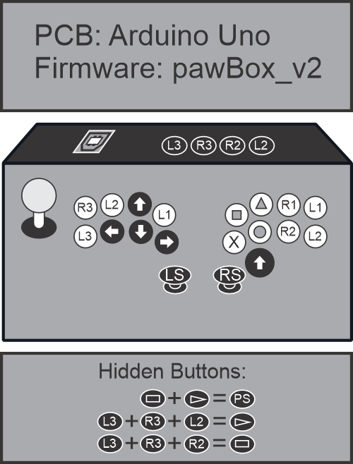

# 🕹️ pawBox + UnoJoy
## Custom Arcade Controller Firmware
### Supports two analog sticks, Four SOCD cleaning, and allows switching between analog and digital movement

**Documentation in progress**  
Website: [pawbox.com.ar](https://pawbox.com.ar)

  

How to use:

1)Upload the firmware pawBoxV2.ino to your PCB

2)Set the pins as follows:

| Pin | PS Button  | Xbox Button  | Type    |
|-----|------------|-------------|----------|
| 2   | L2         | LT          | Digital  |
| 3   | R2         | RT          | Digital  |
| 4   | L1         | LB          | Digital  |
| 5   | R1         | RB          | Digital  |
| 6   | Circle     | B / 4       | Digital  |
| 7   | Cross      | A / 3       | Digital  |
| 8   | Triangle   | Y / 2       | Digital  |
| 9   | Square     | X / 1       | Digital  |
| 10  | Up         | Arriba      | Digital  |
| 11  | Right      | Derecha     | Digital  |
| 12  | Down       | Abajo       | Digital  |
| 13  | Left       | Izquierda   | Digital  |
| A5  | L3         | L3          | Analog   |
| A4  | R3         | R3          | Analog   |
| A3  | Y Axis     | L Stick     | Analog   |
| A2  | X Axis     | L Stick     | Analog   |
| A1  | Y Axis     | R Stick     | Analog   |
| A0  | X Axis     | R Stick     | Analog   |

As you can see, the PCB is limited in the number of available inputs.
But don’t worry — you can activate hidden buttons with the following combinations:

| Function 	| Button Combination |
|-----------|--------------------|
| Select 	| L3 + R3 + R2 |
| Start  	| L3 + R3 + L2 |
| Home   	| L3 + R3 + R2 + L2 *(or Select + Start)* |

3)Put your PCB into DFU mode.

How to put your Arduino into DFU mode:
    Short two of the pins on the block of six pins located next to the USB connector.
    Using a small wire or metal object, connect the two pins closest to the USB connector together.

ONCE YOU ARE IN DFU MODE:

4)Run TurnIntoAJoystick.bat (you may need to install Atmel Flip).

	Once the Arduino is in DFU mode, to update the firmware, simply click:

	Windows: TurnIntoAJoystick.bat
			 
	OSX:     TurnIntoAJoystick.command
	
	Linux:   ./TurnIntoAJoystic.sh

	IMPORTANT: Once you update the firmware, you'll need to 
	unplug and plug the Arduino back in for it to show up with
	the new firmware - it'll just hang out in DFU mode until you do.

	When you plug the Arduino in again now, it will show up to your
	computer as an 'pawbox Joystick'.  You can check this by doing
	the steps in the next section.

5)To revert your Arduino back to its original firmware,run TurnIntoAnArduino.bat 
Remember to put the board into DFU mode before updating.

